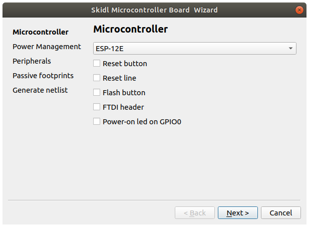
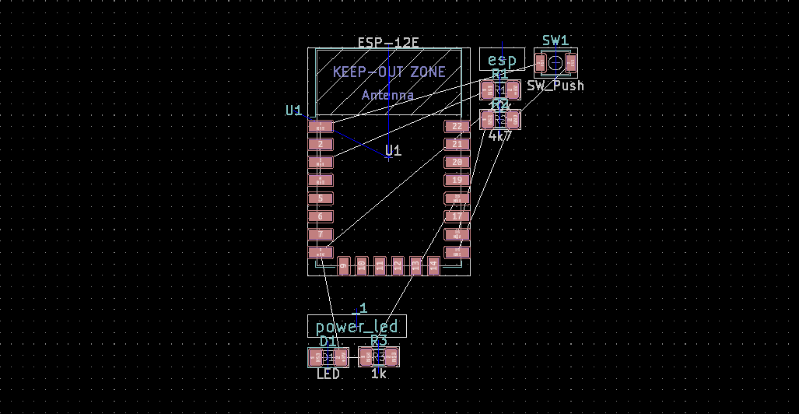

# skimibowi - SKiDL Microcontroller Board Wizard


[QT](qt.io) Wizard for creating [SKiDL](https://github.com/xesscorp/skidl) descriptions of microcontroller boards. Skimibowi creates Python programs that create [KiCad](http://www.kicad-pcb.org/) netlists ready for PCB layout with Pcbnew.



When wizard generated Python program..

```python
#Generated by Swimibowi - SKiDL Microcontroller Board Wizard
"""Creates Kicad netlist file for a microcontroller board"""
from skidl import Part, Net, generate_netlist, subcircuit


def subcircuit_label(name):
    """Creates subcircuit label footprint"""
    Part('./library/Skimibowi.lib', 'Label', ref=" ", value=name, 
         footprint=f"Skimibowi:label{len(name)}")

def R(value):
    """Creates default resistor footprint"""
    return Part('Device', 'R', value=value, footprint='Resistor_SMD:R_1206_3216Metric')

@subcircuit
def generate_esp():
    """Generate ESP-module code to circuit"""
    subcircuit_label('esp')
    global U1
    U1 = Part('RF_Module', 'ESP-12E', footprint='RF_Module:ESP-12E')

    U1['VCC'] += Net.fetch('+3V')
    U1['GND'] += Net.fetch('GND')
    U1['EN'] & R('10k') & Net.fetch('+3V')
    U1['GPIO15'] & R('4k7') & Net.fetch('GND')

    U1['RST'] += Net.fetch('RST')
    U1['GPIO16'] += Net.fetch('RST')

    @subcircuit
    def generate_power_led():
        """Generate led connected to ESP GPI0 that is on after boot"""
        subcircuit_label('power_led')
        led = Part('Device', 'LED', footprint='LED_SMD:LED_1206_3216Metric')
        U1['GPIO0'] & (R('1k') & led & Net.fetch('+3V'))

    generate_power_led()

    # Generate button for pulling ESP RST pin to low (e.g. reset)

    sw_reset = Part('Switch', 'SW_Push', footprint="Button_Switch_SMD:SW_SPST_B3U-1000P")
    sw_reset[1] += Net.fetch('RST')
    sw_reset[2] += Net.fetch('GND')

generate_esp()


generate_netlist()
```

.. is executed with

```bash
> python3 mcu.py
```

the following netlist is generated:

```
(export (version D)
  (design
    (source "mcu.py")
    (date "02/02/2020 04:46 PM")
    (tool "SKiDL (0.0.28)"))
  (components
    (comp (ref " ")
      (value esp)
      (footprint Skimibowi:label3)
      (fields
        (field (name F0) _)
        (field (name F1) Label))
      (libsource (lib ./library/Skimibowi.lib) (part Label))
      (sheetpath (names /top/generate_esp0/6775841524177316650) (tstamps /top/generate_esp0/6775841524177316650)))
    (comp (ref " _1")
      (value power_led)
      (footprint Skimibowi:label9)
      (fields
        (field (name F0) _)
        (field (name F1) Label))
      (libsource (lib ./library/Skimibowi.lib) (part Label))
      (sheetpath (names /top/generate_esp0/generate_power_led0/14059041834838259427) (tstamps /top/generate_esp0/generate_power_led0/14059041834838259427)))
    (comp (ref D1)
      (value LED)
      (footprint LED_SMD:LED_1206_3216Metric)
      (fields
        (field (name datasheet) ~)
        (field (name F0) D)
        (field (name description) "Light emitting diode")
        (field (name F1) LED)
        (field (name keywords) "LED diode"))
      (libsource (lib Device) (part LED))
      (sheetpath (names /top/generate_esp0/generate_power_led0/9220504182991079147) (tstamps /top/generate_esp0/generate_power_led0/9220504182991079147)))
    (comp (ref R1)
      (value 10k)
      (footprint Resistor_SMD:R_1206_3216Metric)
      (fields
        (field (name datasheet) ~)
        (field (name F0) R)
        (field (name description) Resistor)
        (field (name F1) R)
        (field (name keywords) "R res resistor"))
      (libsource (lib Device) (part R))
      (sheetpath (names /top/generate_esp0/6393904598237148148) (tstamps /top/generate_esp0/6393904598237148148)))
    (comp (ref R2)
      (value 4k7)
      (footprint Resistor_SMD:R_1206_3216Metric)
      (fields
        (field (name datasheet) ~)
        (field (name F0) R)
        (field (name description) Resistor)
        (field (name F1) R)
        (field (name keywords) "R res resistor"))
      (libsource (lib Device) (part R))
      (sheetpath (names /top/generate_esp0/4087014578734036955) (tstamps /top/generate_esp0/4087014578734036955)))
    (comp (ref R3)
      (value 1k)
      (footprint Resistor_SMD:R_1206_3216Metric)
      (fields
        (field (name datasheet) ~)
        (field (name F0) R)
        (field (name description) Resistor)
        (field (name F1) R)
        (field (name keywords) "R res resistor"))
      (libsource (lib Device) (part R))
      (sheetpath (names /top/generate_esp0/generate_power_led0/9742915000343388170) (tstamps /top/generate_esp0/generate_power_led0/9742915000343388170)))
    (comp (ref SW1)
      (value SW_Push)
      (footprint Button_Switch_SMD:SW_SPST_B3U-1000P)
      (fields
        (field (name datasheet) ~)
        (field (name F0) SW)
        (field (name description) "Push button switch, generic, two pins")
        (field (name F1) SW_Push)
        (field (name keywords) "switch normally-open pushbutton push-button"))
      (libsource (lib Switch) (part SW_Push))
      (sheetpath (names /top/generate_esp0/4871690332137215268) (tstamps /top/generate_esp0/4871690332137215268)))
    (comp (ref U1)
      (value ESP-12E)
      (footprint RF_Module:ESP-12E)
      (fields
        (field (name datasheet) http://wiki.ai-thinker.com/_media/esp8266/esp8266_series_modules_user_manual_v1.1.pdf)
        (field (name F2) RF_Module:ESP-12E)
        (field (name F0) U)
        (field (name description) "802.11 b/g/n Wi-Fi Module")
        (field (name _aliases) ESP-12F)
        (field (name F1) ESP-12E)
        (field (name keywords) "802.11 Wi-Fi"))
      (libsource (lib RF_Module) (part ESP-12E))
      (sheetpath (names /top/generate_esp0/4769537156195853946) (tstamps /top/generate_esp0/4769537156195853946))))
  (nets
    (net (code 0) (name +3V)
      (node (ref D1) (pin 2))
      (node (ref R1) (pin 2))
      (node (ref U1) (pin 8)))
    (net (code 1) (name GND)
      (node (ref R2) (pin 2))
      (node (ref SW1) (pin 2))
      (node (ref U1) (pin 15)))
    (net (code 2) (name N$1)
      (node (ref R1) (pin 1))
      (node (ref U1) (pin 3)))
    (net (code 3) (name N$2)
      (node (ref R2) (pin 1))
      (node (ref U1) (pin 16)))
    (net (code 4) (name N$3)
      (node (ref D1) (pin 1))
      (node (ref R3) (pin 2)))
    (net (code 5) (name N$4)
      (node (ref R3) (pin 1))
      (node (ref U1) (pin 18)))
    (net (code 6) (name RST)
      (node (ref SW1) (pin 1))
      (node (ref U1) (pin 1))
      (node (ref U1) (pin 4))))
)

```

..that can then be imported to Pcbnew:


